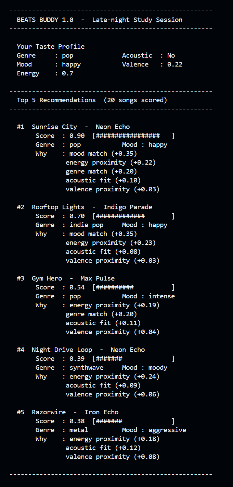
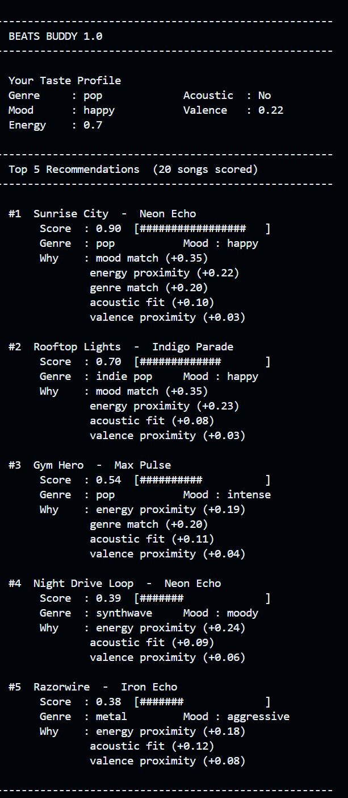
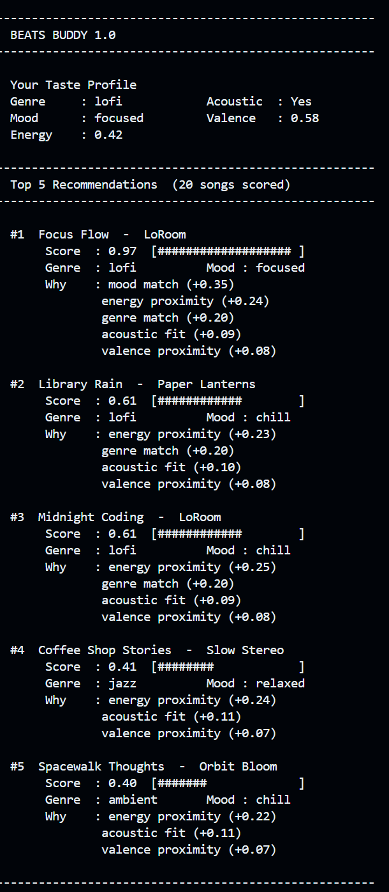

# 🎵 Music Recommender Simulation



## Project Summary

In this project you will build and explain a small music recommender system.

Your goal is to:

- Represent songs and a user "taste profile" as data
- Design a scoring rule that turns that data into recommendations
- Evaluate what your system gets right and wrong
- Reflect on how this mirrors real world AI recommenders

Replace this paragraph with your own summary of what your version does.

---

## How The System Works

Explain your design in plain language.

Some prompts to answer:

- What features does each `Song` use in your system
  - For example: genre, mood, energy, tempo

  My system uses the energy, mood, genre, accousticness and valency features of each song.

- What information does your `UserProfile` store

  My `UserProfile` stores the favorite genre, mood (as strings), target energy (as a float) and a boolean for whether the user prefers acoustic songs.

- How does your `Recommender` compute a score for each song

  Recommender computes a score for each song by finding the weighted sum of the features wich are all in the range of 0 to 1. This means that the score will also be in the range of 0 to 1. Each feature has a different weight, for example genre has a weight of 0.20, mood has a weight of 0.35, energy has a weight of 0.25, acousticness has a weight of 0.12 and valence has a weight of 0.08

- How do you choose which songs to recommend

The songs with the highest scores are the ones that are recommended. The number of songs recommended can be set by the user, but by default it is 3.

You can include a simple diagram or bullet list if helpful.

---

## Getting Started

### Setup

1. Create a virtual environment (optional but recommended):

   ```bash
   python -m venv .venv
   source .venv/bin/activate      # Mac or Linux
   .venv\Scripts\activate         # Windows

2. Install dependencies

```bash
pip install -r requirements.txt
```

3. Run the app:

```bash
python -m src.main
```

### Running Tests

Run the starter tests with:

```bash
pytest
```

You can add more tests in `tests/test_recommender.py`.

---

## Experiments You Tried

Use this section to document the experiments you ran. For example:

- What happened when you changed the weight on genre from 2.0 to 0.5
- What happened when you added tempo or valence to the score
- How did your system behave for different types of users

---

## Limitations and Risks

Summarize some limitations of your recommender.

- Only works on a tiny catalog
- It does not understand lyrics or language
- It might over favor one genre or mood and may not allow the user to discover a new song that they would like but is outside of their stated preferences.


You will go deeper on this in your model card.

---

## Reflection

Read and complete `model_card.md`:

[**Model Card**](model_card.md)

Write 1 to 2 paragraphs here about what you learned:

- about how recommenders turn data into predictions
  I learnt that recommenders use a scoring system to turn data about songs and user preferences into a score that can be used to rank songs. The scoring system can be based on a weighted sum of different features, and the weights can be adjusted to change the importance of each feature.

  Another important thing I learnt is that at scale, companies like Spotify and YouTube, use much more complex models that can capture more subtle patterns in the data as well as user behavior and combination of methods to generate recommendations. However, the basic idea of scoring and ranking is still at the core of how recommenders work.

- about where bias or unfairness could show up in systems like this 
  Bias or unfairness could show up in systems like this if the scoring system is designed in a way that favors certain genres, moods or energy levels over others. For example, if the model gives a very high weight to genre and the user has a very specific genre preference, they might only get recommendations from that genre and miss out on songs from other genres that they might like.

  Additionally, if the dataset of songs is not diverse and mostly reflects the tastes of a certain group of people, the recommendations might be biased towards those tastes and not serve users with different preferences well. This could lead to a lack of diversity in the recommendations and limit the user's discovery of new music.


---

## 7. `model_card_template.md`

Combines reflection and model card framing from the Module 3 guidance. :contentReference[oaicite:2]{index=2}  

```markdown
# 🎧 Model Card - Music Recommender Simulation

## 1. Model Name
  > Beat Buddy 1.0

## 2. Intended Use
- What kind of recommendations does it generate
  This model generates music recommendations based on a user's preferred genre, mood, and energy level. It suggests 3 to 5 songs from a small catalog that match those preferences.
- What assumptions does it make about the user
  It assumes the user's musical tastes can be captured by those three preferences and that they want songs that closely match them. It also assumes the user knows their preferences and that those preferences stay the same during a session.
- Is this for real users or classroom exploration
  This model is for classroom exploration only, not for real users.

## 3. How the Model Works
- What features of each song does it consider
 
  The model uses the genre, energy level, mood, valence, and acousticness of each song.
- What information about the user does it use
  The model considers the user's preferred genre and mood (words), a target energy level (a number), a boolean for whether they prefer acoustic songs, and a valence target (a number).
- How does it turn those into a number
  The model calculates a score for each song by checking how well the song matches the user's preferences. It rewards matches in genre, mood, energy, acousticness, and valence; songs with higher scores are recommended.
- What changes did you make from the starter logic
  I placed more emphasis on mood than genre to encourage a bit of diversity and let users discover songs in nearby genres.

## 4. Data
- How many songs are in the catalog
  The catalog contains 20 songs.
- What genres or moods are represented
  Genres include pop, lofi, rock, ambient, jazz, synthwave, indie pop, hip hop, classical, metal, country, reggae, electronic, folk, rnb, blues, and world.
  Moods include melancholic, moody, nostalgic, playful, relaxed, romantic, somber, sultry, uplifting, chill, intense, and happy.
- Did you add or remove data
  I added 10 more songs and did not remove any data.
- Are there parts of musical taste missing in the dataset
  Lyrics, lexical density, and language are not represented in the dataset.

## 5. Strengths
- User types for which it gives reasonable results
    It gives reasonable results for users with clear preferences for genre, mood, and energy. For example, a user who prefers "Happy" mood, "Pop" genre, and high energy will get appropriate recommendations.
- Any patterns you think your scoring captures correctly
    The scoring captures that mood is a strong signal and that energy helps tell songs apart within the same genre. Acousticness is also useful for users who prefer organic sounds.

- Cases where the recommendations matched your intuition
    For a user preferring a relaxed mood, jazz genre, and low energy, the model returned relaxed jazz tracks that felt appropriate.
- How many songs are in `data/songs.csv`
    There are 20 songs in `data/songs.csv`.
## 6. Limitations and Bias

Where does your recommender struggle

Some prompts:
- Does it ignore some genres or moods
- Does it treat all users as if they have the same taste shape
- Is it biased toward high energy or one genre by default
- How could this be unfair if used in a real product

---

## 7. Evaluation

How did you check your system

Examples:
- I tried multiple user profiles (Late night study "Lo-fi", High-Energy Pop, and Deep Intense Rock) wrote down whether the results matched your expectations
  RESULTS: 
  
  High-Energy Pop:
  

  Late night study "Lo-fi":
  

  Deep Intense Rock:
  

- I wrote tests for your scoring logic to check that it behaves as expected when I change the user profile or song features.

You do not need a numeric metric, but if you used one, explain what it measures.

---

## 8. Future Work

If you had more time, how would you improve this recommender 
 If I had more time, I would add other features to the recommender such as the lyrics, the language of the song, and the popularity of the song. I would also consider using a more complex model that can capture interactions between features, such as a decision tree or a neural network. Additionally, I would like to expand the catalog to include more songs and more diverse genres and moods to better serve users with different tastes.

---

## 9. Personal Reflection

A few sentences about what you learned:

- What surprised you about how your system behaved
  At first I was surprised that the model was able to capture some of the nuances of musical taste with such a simple scoring system. I expected it to be more rigid and less able to provide good recommendations, but it did a decent job for users with clear preferences.

- How did building this change how you think about real music recommenders
  Building this simple recommender made me appreciate how much work goes into the complex models used by real music streaming services like Spotify or YouTube. It also made me realize that even a simple model can capture some of the key factors that influence musical taste, but that there are many other factors and interactions that real recommenders need to consider to provide good recommendations to a wide range of users.

- Where do you think human judgment still matters, even if the model seems "smart"

    Throughout this project I had to make a lot of subjective decisions about how to design the scoring system, what features to include, and how to weight them. This made me realize that even if a model seems "smart" in terms of its ability to capture patterns in the data, human judgment is still crucial in shaping how the model works and what it prioritizes. For example, deciding that mood should have a higher weight than genre was a subjective choice that influenced the recommendations significantly. In real music recommenders, human judgment is also important in curating the catalog, defining features, and setting goals for what kind of recommendations they want to provide to users.
